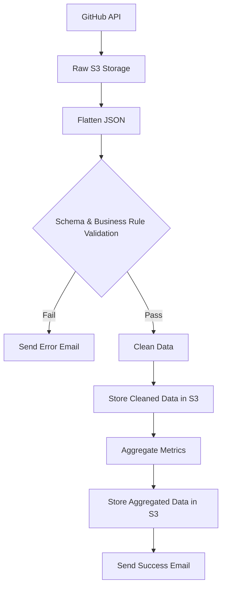

# GitHub Repository ETL Pipeline

This pipeline demonstrates a complete ETL (Extract, Transform, Load) workflow using Prefect and AWS S3. It processes GitHub repository data through multiple stages of transformation and validation.

## Getting Started

### Setting up your environment

1. Install uv (if not already installed):
   ```bash
   pip install uv
   ```

2. Create and activate a virtual environment:
   ```bash
   uv venv
   source .venv/bin/activate  # On Unix/macOS
   # or
   .venv\Scripts\activate  # On Windows
   ```

3. Install dependencies:
   ```bash
   uv pip install -r requirements.txt
   ```

### Requirements
```
prefect>=2.14.0
prefect-aws>=0.3.8
prefect-email>=0.3.5
httpx>=0.25.0
pandas>=2.0.0
pydantic>=2.0.0
boto3>=1.28.0
```

### Prefect Blocks Setup
The pipeline requires the following Prefect blocks to be configured:

1. AWS Credentials Block:
   ```bash
   prefect block register -m prefect_aws
   ```
   Then create an AWS credentials block with your AWS credentials.

2. Email Credentials Block:
   ```bash
   prefect block register -m prefect_email
   ```
   Create an email server credentials block with your email settings.

## Configuration

The pipeline can be configured using either:

1. **Direct Implementation** (`hello.py`):
   - Uses hardcoded values
   - Ready for immediate use with specific settings

2. **Configurable Version** (`example-etl.py`):
   - Customize these variables at the top of the file:
   ```python
   AWS_CREDENTIALS_BLOCK = "your-aws-credentials-block-name"
   S3_BUCKET_NAME = "your-s3-bucket-name"
   AWS_REGION = "your-aws-region"
   EMAIL_CREDENTIALS_BLOCK = "your-email-credentials-block-name"
   NOTIFICATION_EMAIL = "your-email@example.com"
   MIN_STARS_THRESHOLD = 10  # Minimum stars required
   ```

## Human-in-the-Loop Input

The pipeline begins with a human-in-the-loop step using Prefect's UI:
- Pauses for manual input of GitHub repository path
- Expects format: `Organization/Repository` (e.g., "PrefectHQ/prefect")
- Resumes processing after input is provided

## Pipeline Overview

The pipeline executes the following steps in sequence:

1. **Data Extraction**
   - Takes a GitHub repository path as input through Prefect's UI
   - Requests repository data from GitHub API
   - Stores raw data into AWS S3 bucket as `raw-data-example.txt`

2. **Data Transformation - Part 1**
   - Reads the raw JSON dataset
   - Flattens the nested JSON structure using pandas
   - Saves flattened data as `flattened-data.txt`

3. **Data Validation**
   - Validates data against GithubRepoSchema (name, full_name, stargazers_count, etc.)
   - Checks business rules (e.g., stargazers count >= MIN_STARS_THRESHOLD)
   - If validation fails:
     - Sends error notification email
     - Stops processing
   - If validation succeeds:
     - Continues to next steps

4. **Data Cleaning**
   - Structures data according to GithubRepoSchema
   - Creates a clean, standardized format
   - Saves cleaned data as `cleaned-data.json`
   - Uploads to S3

5. **Data Aggregation**
   - Calculates engagement metrics:
     - Total engagement (stars + watchers + forks)
     - Individual metric totals
     - Engagement ratio (stars/watchers)
   - Adds timestamp
   - Saves as `aggregated-data.json`
   - Uploads to S3
   - Sends completion notification

## Pipeline Flow



## Data Schema

The pipeline validates and processes the following GitHub repository metrics:

```python
class GithubRepoSchema(BaseModel):
    name: str
    full_name: str
    stargazers_count: int
    watchers_count: int
    forks_count: int
```

## S3 Storage Structure

Data is stored in AWS S3 with the following structure:
- Raw data: `s3://{bucket_name}/raw-data-example.txt`
- Cleaned data: `s3://{bucket_name}/cleaned-data.json`
- Aggregated data: `s3://{bucket_name}/aggregated-data.json`

## Notifications

The pipeline includes email notifications for:
- Validation failures (with error details and flow run link)
- Successful completion (with flow run link)

## Usage

1. For customized configuration:
   - Copy `example-etl.py`
   - Update configuration variables at the top
   - Run:
   ```bash
   python example-etl.py
   ```

When prompted in the Prefect UI, enter a GitHub repository path (e.g., "PrefectHQ/prefect").
