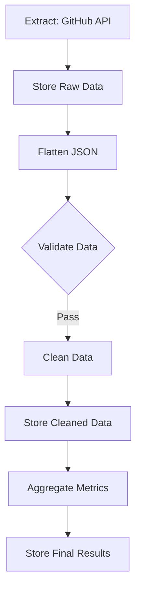

# GitHub Repository ETL Pipeline

This example demonstrates two approaches to building ETL pipelines with Prefect, letting you choose how much of Prefect's functionality you want to use:

1. **Full Prefect Integration** (`full-example-etl.py`): Uses Prefect's advanced feature set
2. **Orchestration Only** (`simple-example-etl.py`): Uses Prefect just for workflow orchestration

## Approach 1: Full Prefect Integration

Use this approach when you want to leverage Prefect's complete feature set:

### Features
- Prefect Blocks for AWS credentials management
- Built-in S3 integration with `prefect-aws`
- Email notifications using `prefect-email`
- Human-in-the-loop capabilities
- Automatic retries and error handling
- Flow run tracking and observability

### Setup
1. Configure Prefect Blocks:
   ```bash
   # Register required blocks
   prefect block register -m prefect_aws
   prefect block register -m prefect_email
   
   # Create blocks in UI:
   # - AWS Credentials
   # - S3 Bucket
   # - Email Server Credentials
   ```

2. Update configuration in `full-example-etl.py`:
   ```python
   AWS_CREDENTIALS_BLOCK = "my-aws-creds"
   S3_BUCKET_NAME = "my-etl-bucket"
   AWS_REGION = "us-east-1"
   EMAIL_CREDENTIALS_BLOCK = "my-email-notifications"
   NOTIFICATION_EMAIL = "your-email@example.com"
   ```

### Running
```bash
python full-example-etl.py
```
Then enter repository name in Prefect UI when prompted.

## Approach 2: Orchestration Only

Use this approach when you want to:
- Keep your existing AWS/infrastructure setup
- Use Prefect primarily for workflow orchestration
- Maintain direct control over AWS interactions
- Simplify deployment and configuration

### Features
- Direct boto3 integration with AWS
- Simpler configuration
- Fewer dependencies
- More control over AWS interactions
- Still benefits from Prefect's orchestration

### Setup
1. Configure AWS credentials as environment variables or AWS CLI
2. Update configuration in `simple-example-etl.py`:
   ```python
   AWS_S3_BUCKET_NAME = 'my-bucket'
   AWS_REGION = 'us-east-1'
   AWS_ACCESS_KEY = 'my-access-key'
   AWS_SECRET_KEY = 'my-secret-key'
   ```

### Running
```bash
python simple-example-etl.py \
  --repository "PrefectHQ/prefect" \
  --min-stars 100 \
  --output-bucket "my-etl-results"
```

## Choosing Your Approach

### Use Full Integration When You:
- Want a complete Prefect-managed solution
- Need built-in notifications
- Want human-in-the-loop capabilities
- Prefer using Prefect's block system
- Need advanced error handling

### Use Orchestration Only When You:
- Have existing AWS setup you want to keep
- Prefer direct control over AWS interactions
- Want simpler deployment
- Need fewer dependencies
- Are just getting started with Prefect

## Common Features (Both Approaches)

Both examples provide:
- ETL workflow orchestration
- GitHub API data extraction
- Data validation with Pydantic
- Data cleaning and transformation
- Aggregation calculations
- S3 storage integration

## Pipeline Flow



## Data Schema

```python
class GithubRepoSchema(BaseModel):
    name: str
    full_name: str
    stargazers_count: int
    watchers_count: int
    forks_count: int
```

## Getting Started

1. Clone the repository
2. Choose your approach (full or orchestration-only)
3. Install dependencies:
   ```bash
   pip install -r requirements.txt
   ```
4. Follow setup for your chosen approach
5. Run the example

## Prerequisites

- Python 3.12 or higher
- AWS account and credentials
- Prefect Cloud account (for full integration)
- GitHub API access
